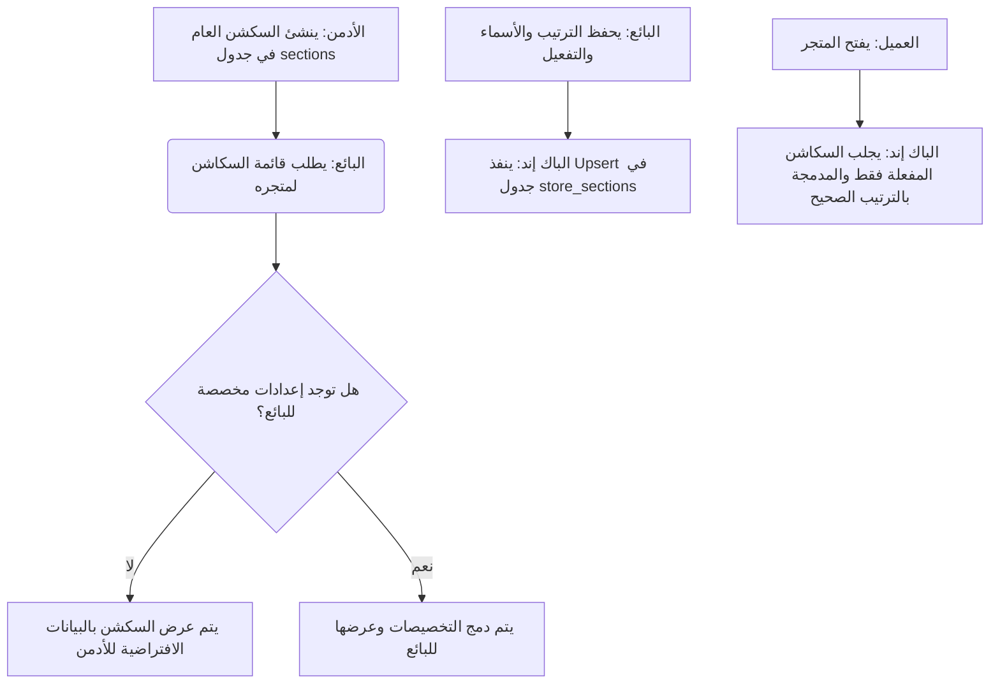

# 📋 مواصفات الباك إند: التحكم في ترتيب وظهور سكاشن المتجر (Store Web Sections)

هذا المستند يوضح التصميم البرمجي وإعدادات قاعدة البيانات ونقاط الاتصال (API Endpoints) لميزة التحكم في ترتيب وظهور سكاشن المتجر على الويب، حيث يقوم **الأدمن** بإدخال السكاشن الأساسية للنظام، ويتحكم **البائع** في تفعيلها وترتيبها وتسميتها الخاصة بمتجره.

---

## 🔄 دورة حياة الميزة (Feature Workflow)



---

## 🗄️ 1. تصميم قاعدة البيانات (Database Schema)

لتحقيق الفصل بين السكاشن العامة للنظام والسكاشن المخصصة لكل متجر، يتم استخدام الجدولين التاليين:

### أ) جدول السكاشن العامة: `sections`
*خاص بالأدمن فقط لتحديد السكاشن المدعومة بالنظام.*

| اسم الحقل | النوع | الوصف |
| :--- | :--- | :--- |
| `id` | `INT` (PK, Auto Increment) | معرف السكشن الفريد |
| `section_key` | `VARCHAR(100)` (Unique) | الكود التعريفي للسكشن برمجياً (مثل: `main_banner`) |
| `default_name` | `VARCHAR(255)` | الاسم الافتراضي للقسم (مثل: "البانر الرئيسي") |
| `is_globally_active` | `TINYINT` (Default: 1) | هل السكشن متاح للنظام؟ (إذا تم تعطيله يختفي من كل المتاجر) |
| `default_sort_order` | `INT` (Default: 0) | الترتيب الافتراضي الأولي للسكشن |
| `created_at` / `updated_at` | `TIMESTAMP` | توقيت الإنشاء والتعديل |

---

### ب) جدول تخصيص السكاشن للمتاجر: `store_sections`
*خاص بالبائعين لتخزين إعداداتهم المخصصة.*

| اسم الحقل | النوع | الوصف |
| :--- | :--- | :--- |
| `id` | `INT` (PK, Auto Increment) | معرف السجل |
| `store_id` | `INT` (FK -> `stores`) | معرف المتجر |
| `section_id` | `INT` (FK -> `sections`) | معرف السكشن العام |
| `custom_name` | `VARCHAR(255)` (Nullable) | الاسم المخصص المكتوب بواسطة البائع |
| `is_active` | `TINYINT` (Default: 1) | حالة تفعيل السكشن في المتجر (1 = ظاهر، 0 = مخفي) |
| `sort_order` | `INT` | الترتيب المخصص الذي حدده البائع |
| `created_at` / `updated_at` | `TIMESTAMP` | توقيت الإنشاء والتعديل |

> [!IMPORTANT]
> يجب وضع قيد فريد مركب (Composite Unique Key) على الحقلين `(store_id, section_id)` لمنع تكرار الإعدادات لنفس القسم في نفس المتجر.

---

## 🔌 2. نقاط الاتصال المطلوبة (API Endpoints)

### 🛡️ أ) لوحة تحكم الأدمن (Admin Dashboard Endpoints)
تستخدم لإدخال وإدارة السكاشن المدعومة في النظام.

#### 1. إضافة سكشن جديد
* **Endpoint:** `POST /api/v1/admin/store-sections`
* **Request Body:**
```json
{
  "section_key": "popular_items",
  "default_name": "الأكثر مبيعاً",
  "default_sort_order": 3
}
```

#### 2. تعديل بيانات السكشن العام
* **Endpoint:** `PUT /api/v1/admin/store-sections/{id}`
* **Request Body:**
```json
{
  "default_name": "الأكثر طلباً وتفضيلاً",
  "is_globally_active": 1,
  "default_sort_order": 3
}
```

#### 3. حذف سكشن عام
* **Endpoint:** `DELETE /api/v1/admin/store-sections/{id}`

---

### 🏪 ب) لوحة تحكم البائع (Vendor Control Panel Endpoints)
تستخدم لعرض وتعديل السكاشن الخاصة بمتجر البائع.

#### 1. جلب الترتيب والحالة الحالية لسكاشن المتجر
* **Endpoint:** `GET /api/v1/vendor/store/sections`
* **Headers:** `Authorization: Bearer {token}`
* **طريقة عمل الاستعلام (Query Logic):**
  يتم دمج السكاشن العامة مع إعدادات البائع باستخدام `LEFT JOIN` وإرجاع القيم الافتراضية كـ Fallback في حال لم يقم البائع بتعديلها بعد:
  ```sql
  SELECT 
    s.id as section_id,
    s.section_key,
    s.default_name,
    COALESCE(ss.custom_name, s.default_name) as custom_name,
    COALESCE(ss.is_active, 1) as is_active,
    COALESCE(ss.sort_order, s.default_sort_order) as sort_order
  FROM sections s
  LEFT JOIN store_sections ss 
    ON s.id = ss.section_id AND ss.store_id = {vendor_store_id}
  WHERE s.is_globally_active = 1
  ORDER BY sort_order ASC;
  ```
* **Response Body:**
```json
{
  "status": true,
  "data": [
    {
      "section_id": 1,
      "section_key": "main_banner",
      "default_name": "البانر الرئيسي",
      "custom_name": "عروض الصيف المميزة",
      "is_active": 1,
      "sort_order": 1
    },
    {
      "section_id": 2,
      "section_key": "featured_categories",
      "default_name": "الأقسام المميزة",
      "custom_name": "تسوق حسب القسم",
      "is_active": 1,
      "sort_order": 2
    },
    {
      "section_id": 3,
      "section_key": "popular_items",
      "default_name": "الأكثر مبيعاً",
      "custom_name": "الأكثر طلباً هذا الأسبوع",
      "is_active": 0,
      "sort_order": 3
    }
  ]
}
```

#### 2. تعديل وإعادة حفظ ترتيب وحالة السكاشن
* **Endpoint:** `POST /api/v1/vendor/store/sections/update`
* **Headers:** `Authorization: Bearer {token}`
* **Request Body:**
```json
{
  "sections": [
    {
      "section_id": 1,
      "custom_name": "العروض والخصومات",
      "is_active": 1,
      "sort_order": 2
    },
    {
      "section_id": 2,
      "custom_name": "تسوق حسب القسم",
      "is_active": 1,
      "sort_order": 1
    },
    {
      "section_id": 3,
      "custom_name": "الأكثر طلباً",
      "is_active": 0,
      "sort_order": 3
    }
  ]
}
```
* **طريقة الحفظ (Save Logic):**
  الباك إند يقوم بعملية `Upsert` (تحديث إذا كان السجل موجوداً بناءً على `store_id` و `section_id` أو إدخال جديد إن لم يكن موجوداً).
* **Response Body:**
```json
{
  "status": true,
  "message": "تم تحديث ترتيب وتجهيز سكاشن المتجر بنجاح"
}
```

---

### 👥 ج) تطبيق وموقع العميل (Storefront Endpoint)
يستخدم لعرض السكاشن بالترتيب والتخصيص النهائي للزائر.

#### 1. جلب السكاشن النشطة بالترتيب النهائي للمتجر
* **Endpoint:** `GET /api/v1/stores/details/{store_id}/sections`
* **طريقة عمل الاستعلام (Query Logic):**
  إرجاع السكاشن النشطة فقط عند البائع والتي لم يقم الأدمن بتعطيلها كلياً، مرتبة تصاعدياً حسب `sort_order` الخاص بالبائع:
  ```sql
  SELECT 
    s.section_key,
    COALESCE(ss.custom_name, s.default_name) as custom_name
  FROM sections s
  LEFT JOIN store_sections ss 
    ON s.id = ss.section_id AND ss.store_id = :store_id
  WHERE s.is_globally_active = 1 
    AND COALESCE(ss.is_active, 1) = 1
  ORDER BY COALESCE(ss.sort_order, s.default_sort_order) ASC;
  ```
* **Response Body:**
```json
{
  "status": true,
  "data": [
    {
      "section_key": "featured_categories",
      "custom_name": "تسوق حسب القسم"
    },
    {
      "section_key": "main_banner",
      "custom_name": "العروض والخصومات"
    }
  ]
}
```

---

## 📌 توصيات برمجية إضافية للباك إند

1. **التحقق من صحة المعطيات (Request Validation):**
   - عند تحديث السكاشن للبائع، يجب التأكد من أن الـ `section_id` مرسل لسكشن حقيقي ونشط في جدول `sections`.
2. **معالجة الـ Fallback تلقائياً:**
   - الباك إند يجب أن يعوض الـ `custom_name` بـ `default_name` مباشرة في حال كان الحقل فارغاً أو يحتوي على مسافات فارغة فقط.
3. **الصلاحيات (Permissions):**
   - التحقق من الـ `store_id` التابع للبائع عبر الـ Token لمنع أي متجر من تحديث إعدادات سكاشن متجر آخر.
